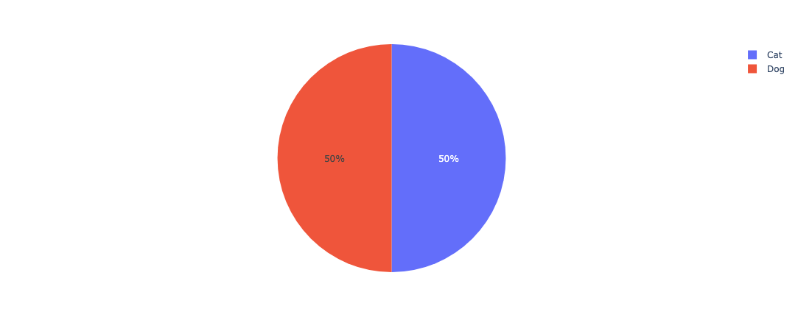
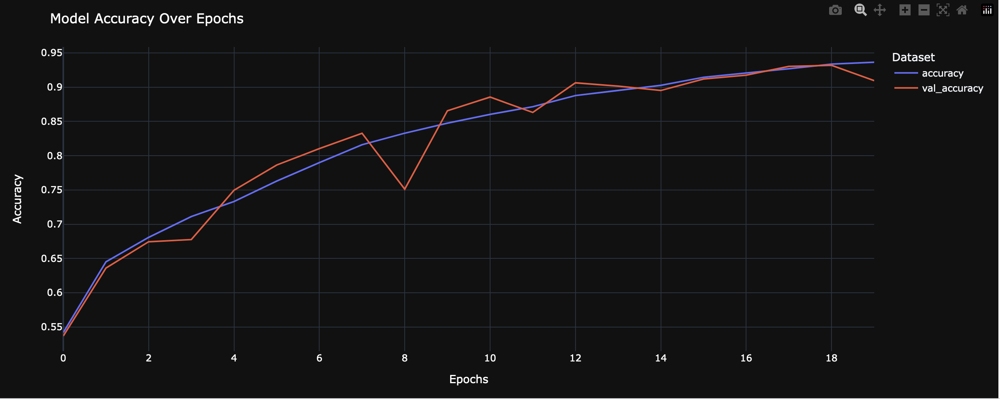
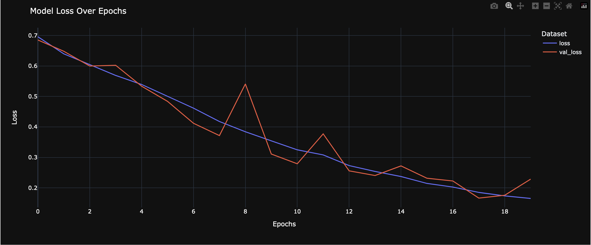
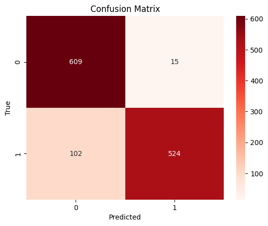
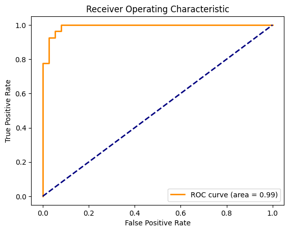

# Cats vs. Dogs Image Classification

## Project Overview
In this project, a convolutional neural network (CNN) was developed to classify images into two categories: Cats and Dogs. Using TensorFlow and Keras, the project involved preprocessing the Cats vs. Dogs dataset, constructing a CNN model, and processing the data through training and validation stages. Key evaluations included the model's accuracy rate and loss value, a detailed analysis using a confusion matrix, an ROC curve, and misclassified images, which were examined for error analysis.

## Dataset:
You can download it on Kaggle here: "https://www.kaggle.com/datasets/shaunthesheep/microsoft-catsvsdogs-dataset"

### Dataset Class Visualization

## Key Features
- Data preprocessing and visualization of class distribution
- CNN model with multiple convolutional, max pooling, and dense layers
- Use of ImageDataGenerators for efficient data handling
- Model training with real-time monitoring of accuracy and loss
- Detailed model evaluation using accuracy metrics, confusion matrix, and ROC curve
- Error analysis through examination of misclassified images

## Model Architecture
The model comprises several layers designed to extract features and perform classification:
- Convolutional layers for feature extraction
- Max pooling layers for dimensionality reduction
- Dense layers for classification

## Results
### Model Accuracy per Epoch

### Model Loss Value per Epoch

### Confusion Matrix

### ROC Curve and AUC

## Conclusion
The project demonstrated the capabilities of CNNs in image classification, with the model showing good potential in distinguishing between cats and dogs. As with any machine learning project, there is room for improvement. Potential future work could involve experimenting with different model architectures, data augmentation techniques, and hyperparameter tuning to enhance model performance. 

I hope you find it useful. Please let me know if you have any feedback or questions. Thank you!

